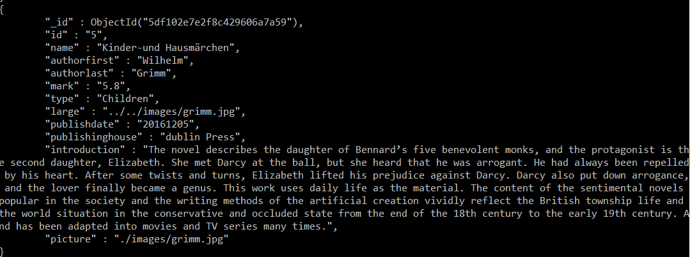

# BSc (Hons.) Level 8 - Assignment 1 - Library web page.

Name: Jinyu Chen

## Overview.

This is a web app with backend, using the mangoDB to store the data.

## Setup.

git clone https://github.com/271110962/ReactBackend.git

cd ReactBackend

npm install

npm start

## Data Model Design.

JSON document data model

## Routes.

. . . . there are 3 routes and associated modeling(Mongoose)integrated with React application allowing manipulation of resources: update, read and delete

.

MongoDB storing the data

## Authentication (Optional).

using the firebase authentication which is the email and password authentication. It support signup and login. The encryption data will store in firebase storage.

